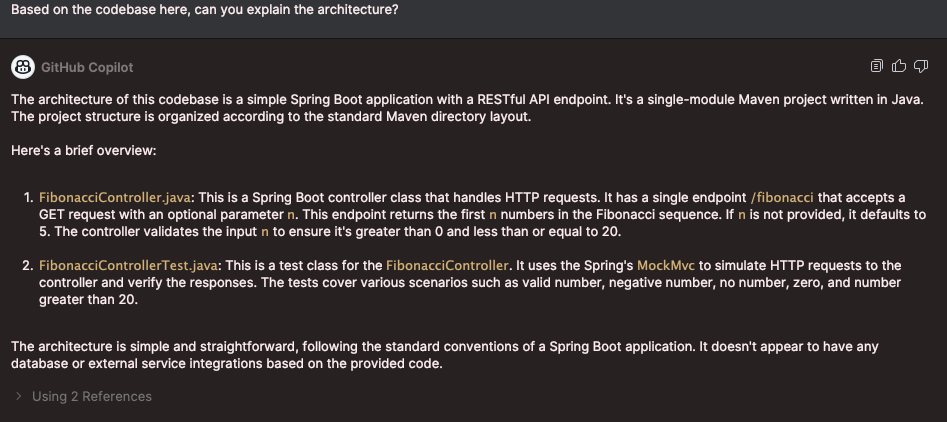

# Code Generation Tools Comparison

This repository contains the code generation tools comparison using a simple spring boot java application. 
See below for the prompts and results of the comparison test.

## Tools
- GitHub Copilot (https://github.com/features/copilot)
- Sourcegraph Cody (https://sourcegraph.com/demo/cody)
- Amazon Q CodeWhisperer (https://aws.amazon.com/codewhisperer/)
- Intellij IDE plugins

## Application
Each application was created using the spring boot CLI with the following command:

```shell
spring init --build=maven --java-version=21 --dependencies=web <application-name>
```
Then I used the code generation tools to:
  
- Create a REST controller to return the fibonacci sequence
- Create unit tests for that controller
- Explain the architecture of the application
- Create CalculatorController class and CalculatorService class based unit tests written by a developer


## Prompts / Approach used for code generation

### Controller

Chat prompt: Create a spring boot controller that has an endpoint that takes in a number as a query parameter and returns the fibonacci sequence in a list. 
When no number is provided it uses a default number of 5. It should throw a bad request for any negative numbers and zero.

Autocomplete comment: Throw bad request if n is greater than 20

### Unit tests

Chat prompt: Create unit tests for the FibonacciController with positive, negative and edge cases.

Autocomplete: Started writing tests for missing scenarios i.e. greater than 20, to see what the code generation tool would do.

### Architecture
Chat prompt: Based on the codebase here, can you explain the architecture?

### Code explanation

Used the code explanation tool provided by both Github Copilot and Cody to explain the DemoApplication.java file.

### Calculator classes

chat prompt: Create CalculatorService class based on CalculatorControllerTest class and create a CalculatorController class based on CalculatorControllerTest class. 
Check if the parameters are valid in the controller before passing them to the service. Include the validation and error handling based on the unit tests. 
Each endpoint in the CalculatorController should return the answer in a json object with an "answer" key. The types of all numbers are integers

## Results

See FibonacciController.java and FibonacciControllerTest.java for the generated code.

### GitHub Copilot

All good things, couldn't fault it.

#### Controller
+ Chat prompt created the controller class with all imports. When that exact controller was used and run, it works with no errors.
+ When autocomplete prompt was used, the code generated was accurate and worked as expected.

#### Unit tests
+ Chat prompt created 3 unit tests to cover the code written by copilot with latest junit5 and included all imports and package name. When that exact test file was run, there were no errors.
+ As soon as I started writing another test, before writing the method name, it generated code for the scenario that was not covered by existing tests.

#### Architecture

+ Chat was able to give an accurate description of the architecture of the directory.


#### Code explanation

+ The copilot /explain command was able to explain the code in the DemoApplication.java file.


#### Calculator classes

##### pros
+ Created the classes once the prompt was specific.

##### cons
- Did miss out on a service annotation.
- The prompt was tweaked a few times until all unit tests were passed so as a developer you need to have a high level idea about where you want what functionality.

### Sourcegraph Cody

#### Controller

##### Pros
+ Chat generates the code for the class.
+ When autocomplete prompt was used, the code generated was accurate and worked as expected.

##### Cons
- Chat generated code did not include the imports unless asked.
- Chat generated code had an example package name, not the actual package name.
- Chat generated code needed human intervention to fix up the file before running.

#### Unit tests

##### Pros
+ Created 4 unit tests to cover the code written by Cody.
+ When autocomplete was used, it will generate new unit test based on test method name.

##### Cons
- Chat created a file where imports were incorrect, so tests will not run (using junit4 rather than latest junit5).
- Chat also missed the package name at the top.
- Chat code generation needed human intervention to fix up the file before running.
- Autocomplete cannot figure out missing test scenarios based on existing test scenarios in the file.

#### Architecture

- Was not able to give any explanation of the architecture of the directory and the explanation given was incorrect.


#### Calculator classes

##### pros
+ Created generic classes not based on the tests.

##### cons
- Did not create classes based on tests so did not do what was intended.
- Does not seem to be aware of files in the directory. Not sure if this is a disabled feature for free tier.

#### Code explanation

- Cody's Explain Code action was able to explain the code in the DemoApplication.java file.


### Amazon Q

#### Controller

##### Pros
+ Amazon Q chat generated the class code, with imports when asked for them.
+ When autocomplete prompt was used, the code generated was accurate and worked as expected.

##### Cons
- Chat did not provide imports unless asked for.
- Code generated by chat included full import in the code rather than the top of the file. This is not best practice.

#### Unit tests

##### Pros
+ Autocomplete generated test based on test method name

##### Cons
- Chat code generation produces incorrect tests and imports were missing.
- Human intervention needed to make the chat generated test code run.

#### Architecture

+ Chat was able to give an accurate description of the architecture of the directory.

#### Calculator classes

##### pros
+ Created generic classes not based on the tests.

##### cons
- Did not create classes based on tests so did not do what was intended. 
- Missing the multiply and divide methods.


#### Code explanation

+ Amazon Q's explain code was able to explain the DemoApplication.java file.


## Summary of results

- All tools take into account existing code and generates code based on that. They also generates code based on the prompt given.
- Github Copilot is able to generate code with imports and package names, Cody and Amazon Q had trouble with this.
- Github Copilot can start generating new code/ missing test scenarios without any comment or method name, whereas Cody and Amazon Q seems to require a method name or comment to generate code.
- Github Copilot Chat And Amazon Q are able to generate an accurate description of the architecture of the directory, Cody was not able to do this.
- All tools were able to explain the code in a particular file.
- All tools are available in the IDE and can answer coding questions.
